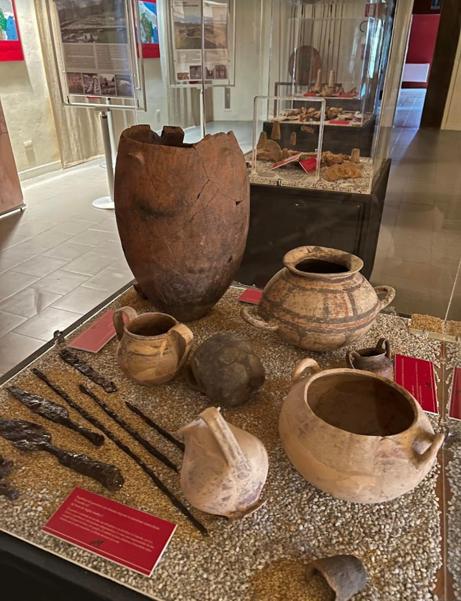

# IL MIO PORTFOLIO

<aside>
💡

BIO
---
CHI SONO?
---
Mi chiamo Martina Montesano, vengo da un piccolo paesino della Basilicata in provincia di Potenza, Vaglio Basilicata. 

Ho frequentato l’istituto superiore I.I.S Leonardo Da Vinci Potenza, scegliendo l’indirizzo Amministrazione-Finanza e Marketing.

Attualmente sono una studentessa di Informatica presso l’Università degli studi della Basilicata. 

Posseggo un forte senso civico e di appartenenza del territorio, grazie alle attività che ho svolto mediante la partecipazione al Servizio Civile Universale e il volontariato attivo negli scavi archeologici di Vaglio Basilicata.
---
" Il mio percorso assembla la costante curiosità per le nuove tecnologie alla precisione e responsabilità appresa durante il volontariato nel mio paese, Vaglio Basilicata, con l’obiettivo
di rendere il mondo della tecnologia alla portata di tutti."
--- 
</aside>

<aside>
 
🛠
COMPETENZE TECNICHE
---
Oltre alla conoscenza della sintassi, mi appassiona la logica che è un pilastro fondamentale dell’Informatica. 

La logica viene utilizzata per la risoluzione dei problemi, e per la capacità di progettazione tracciando ogni singolo passaggio per garantirne la completa trasparenza.
---
Vi presento un’illustrazione dei componenti essenziali di un programma base: C++
 ```cpp 
"#include<iostream>
using namespace std;
int main () { //commento: è il punto di inizio principale
// Dichiarazione: (esempio come int voti[5]
// Azioni con l'uso dei cicli for ad esempio
cout<<"  "; //output
cin>> //input 
return 0;
}"
```
 "#include<iostream>" 
 ---
Spiegazione: permette al programma di ricevere dati [I] Input, 
possiamo ricordarlo con la domanda “cosa chiedo all’utente con il comando cin>>?”
e mandarli a schermo [O] Output,
possiamo ricordarlo con la domanda “cosa dobbiamo servire/stampare?”

-"using namespace std;"
---
Spiegazione: significa “usa spazio dei nomi standard;” ovvero ci aiuta a semplificare la scrittura evitando di dover riscrivere ogni comando standard ogni qual volta viene citato.

//quel “ **;** “ indica la punteggiatura per il computer, e significa “l’istruzione è finita ne inizierà un altro”
---
- "int main () {"
  ---
Spiegazione: è la parte principale, ho inserito all’interno del codice un **commento** con “//”, spiegando che il computer inizia a leggere proprio da qui.

()= 
---
contengono i parametri, cioè le informazioni che passiamo alla funzione per farla lavorare

{/} = 
---
inizia a eseguire da qui/ termina, sono il corpo della funzione.

return 0;
--- 
Spiegazione: tutto è andato bene, dice al computer che il programma non presenta errori ed è finito.

</aside>

</aside>

<aside>

ESPERIENZE SIGNIFICATIVE
---

🏛️ SERVIZIO CIVILE UNIVERSALE
---

**Ente**: Museo delle Antiche Genti di Lucania 
---
**Periodo**: 2023-2024
---
Durante il mio anno di Servizio Civile, ho operato all'interno di un contesto culturale unico gestendo la valorizzazione sia dei reperti archeologici di Vaglio Basilicata sia dei modelli ingegneristici di Leonardo Da Vinci, attraverso l’area del museo contenente riproduzioni di studi e modellini in legno di vari ambiti. 

[Visualizza Attestato.pdf](Attestato_di_fine_servizio.pdf)
---
ATTIVITA’ E RESPONSABILITA’
---

GESTIONE AREA ARCHEOLOGICA:

 Cura ed esposizione dei reperti alcuni originali, altre riproduzioni del mio territorio appartenenti ai siti di Serra di Vaglio e Rossano.



Area archeologica reperti di Serra di Vaglio e Rossano.
---

GESTIONE AREA SCENTIFICA: 

Cura, approfondimento ed esposizione dettagliata dei modelli delle macchine di Leonardo Da Vinci, permettendomi di spiegare concetti complessi ad un pubblico eterogeneo.

 
---

- Soft Skills:

Capacità di lavorare in team con esperti di differenti settori, partecipando a progetti in gruppo sia in smart working che in presenza, mediante diverse sedi come per esempio l’Unibas.

" Ho imparato a collaborare con persone estranee al mio gruppo di lavoro, sviluppando una grande adattabilità a diversi contesti di altri progetti, aumentando le mie capacità inventive e di problem solving."
--- 
VOLONTARIATO E TERRITORIO
---

👷🏻 Luogo: Scavi di Vaglio Basilicata
Serra di Vaglio-Santuario archeologico di Macchia di Rossano

"Questa esperienza ha consolidato la mia conoscenza territoriale e la mia capacità di analisi visiva poiché in archeologia come in informatica è importante guardare “sotto la superficie” per capirne il funzionamento"

Siti:
    
    
</aside>

<aside>

*Contatti*

 INFORMAZIONI
 ---
 EMAIL: [martinamontesano63@gmail.com](mailto:martinamontesano63@gmail.com) 
---
UNIVERSITA’: Università degli Studi della Basilicata 
---
SEDE : Vaglio Basilicata/Potenza 
---
</aside>

*Ultimo aggiornamento: Febbraio 2026*
